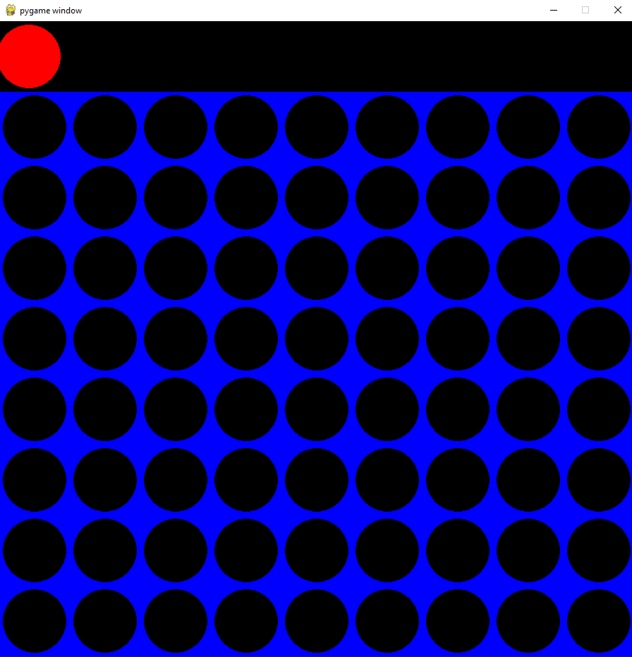

# ConnectX
## Dependencies 
- Numpy
- pygame
- pygame-menu

## About
The following project is a simple connect game made for fun and exploring python where the user can choose from the menu to either play connect 4 or connect 6. Both games support playing against another player or vs the AI in different difficulties.

The algorithm used for the AI is the Minimax Algorithm. A predictive algorithm where the AI branches all the possible moves so it can "look ahead" and end up going with the best "branch" for his game choosing the best move at the time using a scoring system.

  

